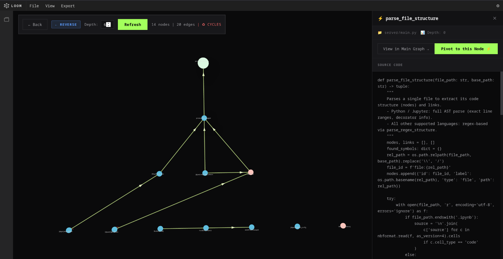
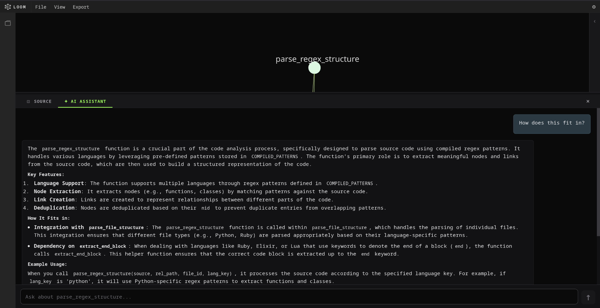
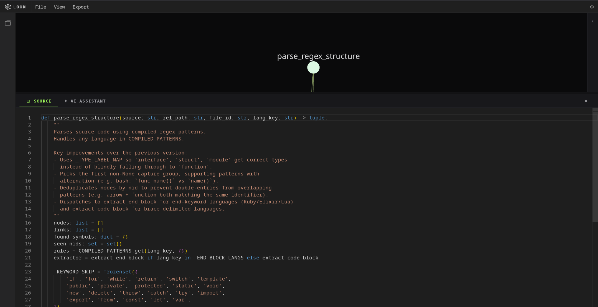
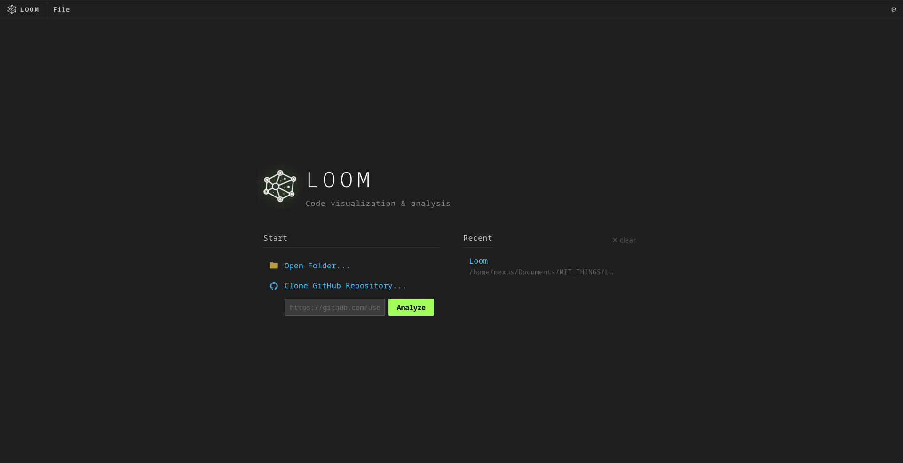
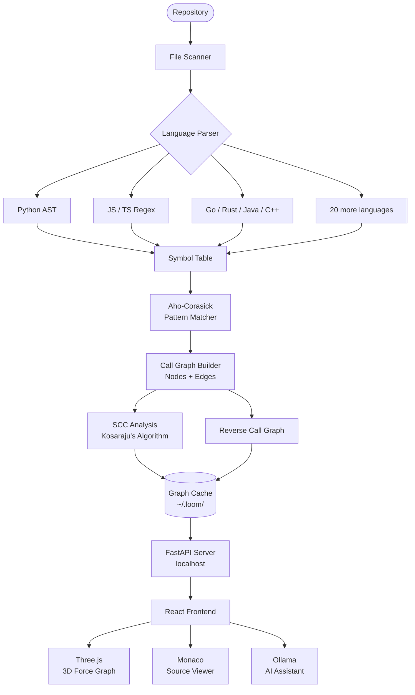

<div align="center">


# Loom

**Understand any codebase. In minutes.**

*A local-first codebase analysis tool. Interactive call graphs, dependency analysis, and source exploration — entirely on your machine.*

<br />

[](https://github.com/DuboidZero/loom/releases)
[](https://github.com/DuboidZero/loom/releases)
[](LICENSE)
[](https://tauri.app)
[](https://python.org)
[](https://react.dev)

<br />

[**Download**](#-installation) · [**How It Works**](#-how-it-works) · [**Architecture**](#-architecture) · [**Philosophy**](#-philosophy)

---

<video src="client/images/demo.webm" autoplay loop muted playsinline controls width="100%"></video>

<br />

━━━━━━━━━━━━━━━━━━━━━━━━━━━━━━━━━━━━━━━━━━━━━━━

🟩 &nbsp;**100% Local** &nbsp;&nbsp;·&nbsp;&nbsp; 🕸 &nbsp;**Interactive 3D Graphs** &nbsp;&nbsp;·&nbsp;&nbsp; ⚡ &nbsp;**GitHub Import** &nbsp;&nbsp;·&nbsp;&nbsp; 🤖 &nbsp;**Optional AI**

━━━━━━━━━━━━━━━━━━━━━━━━━━━━━━━━━━━━━━━━━━━━━━━

</div>

---

## Why Loom?

Jumping into an unfamiliar codebase is one of the most expensive things a developer does.

You open a file. It calls ten things. Each of those calls ten more. You lose the thread. You start over.

Loom fixes that. Drop in any repository — local or GitHub — and within seconds you have a **navigable 3D map** of every function, class, and module, and every relationship between them. Click a node. See who calls it, what it calls, where it lives.

Understanding a new codebase used to take days. With Loom, it takes minutes.

---

## Screenshots

<div align="center">

<!-- Replace paths below with your actual screenshots -->

| 3D Call Graph | AI Code Assistant |
|:---:|:---:|
|  |  |

| Source Viewer | Welcome Screen |
|:---:|:---:|
|  |  |

</div>

---

## Features

| Feature | Description |
|---|---|
| 🕸 **Interactive 3D Call Graph** | Interactive 3D call graph built with Three.js. Rotate, zoom, and explore your entire codebase spatially. |
| 👁 **Integrated Source Viewer** | Click any node to read its full implementation inline, with syntax highlighting, without leaving Loom. |
| ⎇ **GitHub Import** | Paste a GitHub URL. Loom clones and analyzes the repo automatically. |
| 🔁 **Reverse Call Graph** | Flip the graph instantly — see everything that calls a given function, not just what it calls. |
| 🔴 **SCC Detection** | Strongly Connected Components are detected and highlighted. Spot recursive cycles and architectural knots at a glance. |
| 📤 **JSON Export** | Export the full call graph as structured JSON for downstream tooling. |
| ⚡ **Graph Caching** | Large repos are cached after the first scan. Subsequent loads are instant. |
| 🌐 **Multi-language Support** | Broad language support, including Python, JavaScript/TypeScript, Go, Rust, Java, C/C++, C#, and more. |
| 🤖 **AI Code Assistant** | Ask questions about any selected node. The AI receives additional context: source, callers, callees, and git status. |

---

## Supported Languages

<div align="center">

| Language | Extension(s) | Language | Extension(s) |
|---|---|---|---|
| Python | `.py`, `.ipynb` | Rust | `.rs` |
| JavaScript | `.js`, `.jsx` | Java | `.java` |
| TypeScript | `.ts`, `.tsx` | C# | `.cs` |
| Go | `.go` | C / C++ | `.c`, `.cpp`, `.h`, `.hpp` |
| Ruby | `.rb` | Swift | `.swift` |
| Kotlin | `.kt`, `.kts` | Dart | `.dart` |
| PHP | `.php` | Elixir | `.ex`, `.exs` |
| Lua | `.lua` | Zig | `.zig` |
| Scala | `.scala` | Bash / Shell | `.sh`, `.bash` |
| R | `.r` | Perl | `.pl`, `.pm` |

</div>

---

## Architecture

Loom is a [Tauri v2](https://tauri.app) desktop application. A Python backend handles all the heavy lifting — parsing, graph construction, analysis — and exposes a local FastAPI server. The React frontend consumes that API and renders everything in Three.js.



### Data Flow

```
Repository path or GitHub URL
        ↓
  File collection (gitignore-aware, venv-safe)
        ↓
  Per-language parsing → symbol extraction
        ↓
  Aho-Corasick multi-pattern scan → edge discovery
        ↓
  Graph: nodes (functions / classes) + edges (calls)
        ↓
  Kosaraju SCC pass → cycle detection
        ↓
  JSON cache persisted to ~/.loom/graph_cache/
        ↓
  FastAPI REST API served at localhost
        ↓
  React / Three.js renders the live 3D graph
```

---

## Installation

### Prerequisites

- **[Ollama](https://ollama.com)** — required for AI features. Install it, then pull a model:
  ```bash
  ollama pull qwen2.5-coder:7b
  ```
- **Git** — required for GitHub repository import.

---

<details>
<summary><strong>🪟 Windows</strong></summary>
<br />

1. Go to [Releases](https://github.com/DuboidZero/loom/releases) and download the latest `.msi` or `.exe` installer.
2. Run the installer. Windows may show a SmartScreen prompt — click **More info → Run anyway**.
3. Launch **Loom** from the Start Menu.

> Ollama is auto-detected. If it isn't found, Loom walks you through setup on first launch.

</details>

<details>
<summary><strong>🐧 Linux</strong></summary>
<br />

**AppImage (universal)**
```bash
chmod +x Loom_4.0.0_amd64.AppImage
./Loom_4.0.0_amd64.AppImage
```

**Debian / Ubuntu (.deb)**
```bash
sudo dpkg -i loom_4.0.0_amd64.deb
loom
```

> Tested on Arch Linux. Should work on any modern x86-64 distribution.

</details>

<details>
<summary><strong>🔨 Build from Source</strong></summary>
<br />

**Requirements:** Node.js 18+, Python 3.11+, Rust (stable)

```bash
# 1. Clone
git clone https://github.com/DuboidZero/loom.git
cd loom

# 2. Frontend dependencies
cd client && npm install

# 3. Backend dependencies
cd ../server && pip install -r requirements.txt

# 4. Dev mode
cd ../client && npm run tauri dev
```

**Produce a distributable:**
```bash
# Linux (AppImage + .deb)
npm run build:linux

# Windows (.msi + .exe)
npm run build:windows
```

</details>

---

## How It Works

### 1 · Open a Repository

Drop in a local folder or paste a GitHub URL. Loom clones and indexes it automatically.

### 2 · Graph Construction

Loom walks every source file, extracts all function and class definitions, then runs an **Aho-Corasick multi-pattern scan** across each file body to discover call edges. This is a single O(C) pass with no backtracking — it handles repositories with 50,000+ unique symbols without breaking a sweat.

### 3 · Analysis

- **Forward call graph** — what does this function call?
- **Reverse call graph** — what calls this function?
- **SCC detection** — which functions are in a mutual call cycle?

Results are persisted to `~/.loom/graph_cache/` and keyed by a fingerprint of the repository state. The second time you open a repo, the graph is instant.

### 4 · Explore

Navigate the 3D graph freely. Click any node to open its source in the integrated viewer. Toggle between forward and reverse perspectives. Filter by file, language, or call depth.

### 5 · Ask the AI (Optional)

If you have [Ollama](https://ollama.com) running locally, Loom includes an AI assistant. Select any node, open the chat, and ask a question. The assistant receives additional context for its answer:

- The selected function's full source code
- Up to 3 caller function bodies
- The direct callee body
- Call graph relationships
- Git status of the file
- Your full conversation history

It's a useful tool for getting oriented in unfamiliar code. It is not the point of Loom.

---

## Philosophy

Loom is built around one principle: the repository is the source of truth.

Instead of asking developers to manually describe their codebase, Loom analyzes it directly. It reads the code, maps the relationships, and surfaces the structure — automatically.

Everything happens locally. No uploads. No accounts. No cloud. Just your repository and the tools to understand it.

The graph is the product. Everything else — the source viewer, the AI assistant, the export — exists to make the graph more useful.

---

## Tech Stack

<details>
<summary><strong>Show full stack</strong></summary>
<br />

| Layer | Technology |
|---|---|
| Desktop shell | [Tauri v2](https://tauri.app) (Rust) |
| Frontend framework | [React 19](https://react.dev) |
| 3D visualization | [Three.js](https://threejs.org) + [react-force-graph-3d](https://github.com/vasturiano/react-force-graph) |
| Code editor | [Monaco Editor](https://microsoft.github.io/monaco-editor/) |
| Backend | [FastAPI](https://fastapi.tiangolo.com) + [Uvicorn](https://www.uvicorn.org) |
| Pattern matching | [pyahocorasick](https://github.com/WojciechMula/pyahocorasick) |
| Git integration | [GitPython](https://gitpython.readthedocs.io) |
| AI inference | [Ollama](https://ollama.com) (local) |
| Packaging | [PyInstaller](https://pyinstaller.org) + Tauri bundler |

</details>

---

## Project Status

Loom is actively developed in my spare time.

New releases are shipped when they're ready rather than on a fixed schedule. The focus is on building reliable functionality over chasing deadlines.

---

## Contributing

Contributions are welcome. If you're adding a parser for a new language or fixing a graph bug, open a PR. If you're unsure whether something fits, open an issue first.

```bash
# Backend (hot-reload)
cd server
uvicorn main:app --reload --port 8765

# Frontend
cd client
npm start
```

---

## License

Apache 2.0 © [DuboidZero](https://github.com/DuboidZero)

---

<div align="center">

*Built because reading other people's code shouldn't feel like archaeology.*

**[⬆ Back to top](#loom)**

</div>
